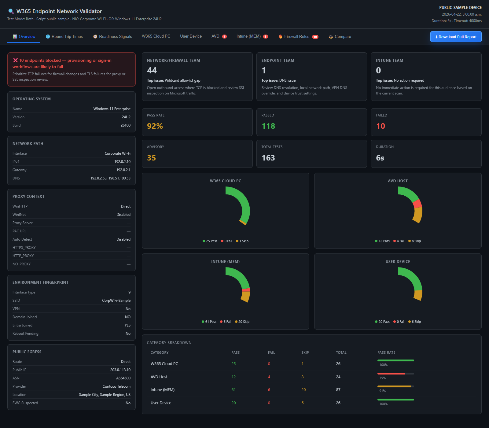
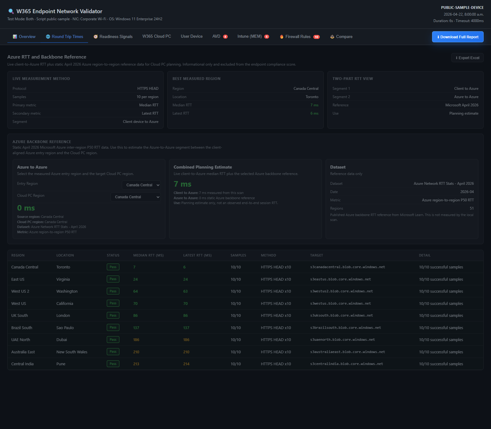
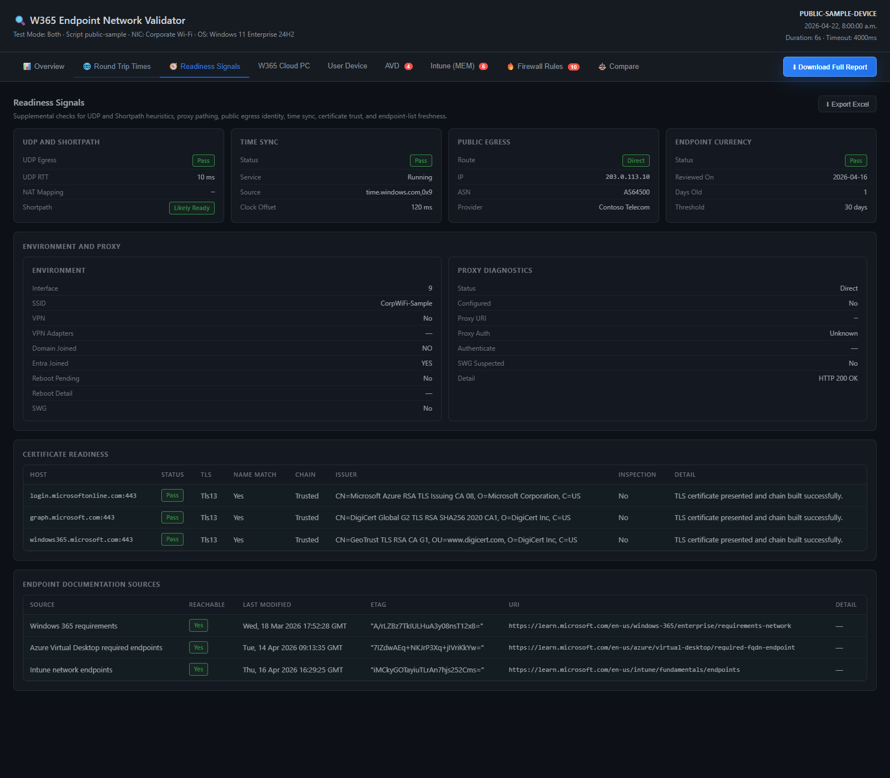

# Sample Output

This folder contains sanitized sample output generated from a real validator run with private device, network, and egress identifiers replaced.

Included files:

- `W365-Results-sanitized-sample.html`: Interactive sample report for screenshots, demos, and repository preview
- `W365-Results-sanitized-sample.json`: Matching JSON payload for inspection or downstream examples
- `screenshots/overview-tab-live.png`: Captured Overview tab preview
- `screenshots/rtt-tab-live.png`: Captured Round Trip Times tab preview
- `screenshots/readiness-tab-live.png`: Captured Readiness Signals tab preview

The sample preserves report structure, endpoint findings, and remediation framing while removing local machine names, private addresses, tenant-specific identifiers, and real network labels.

Overview tab:

Round Trip Times tab:

Readiness Signals tab:

